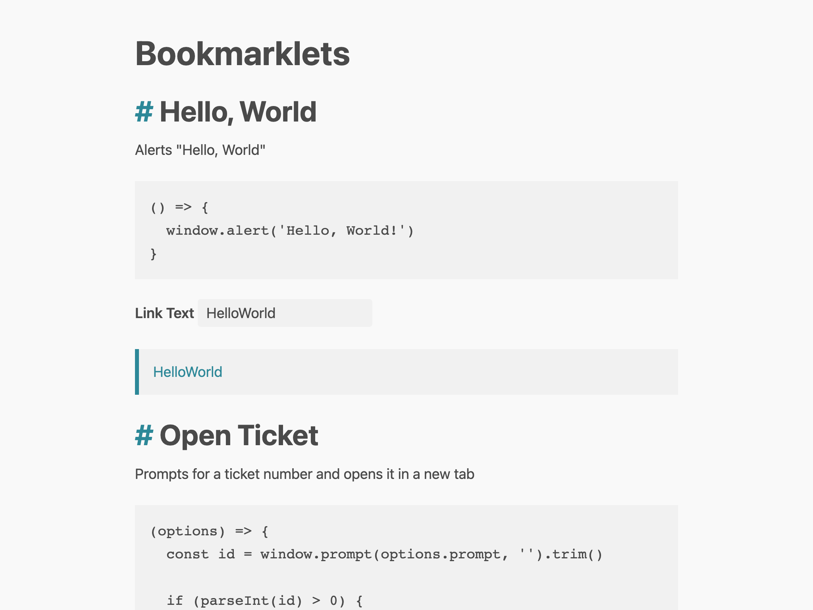

# bookmarklets

An open sporce collection of bookmarklets. Feel welcome to discover and contribute your own browser helpers.



## Contributing

This project uses [pNpm](https://pnpm.io) package manager and ES modules.

### How do I start the project?

Run the following commands:

```
pnpm install
pnpm watch
```

Finally, open `/dist/index.html` in your browser.

### How to add a bookmarklet?

1. Add a new JavaScript file  `/src` folder
1. Create and export an instance of `Bookmarklet` class

Please reference `/src/hello-world.js` for a basic implementation.
